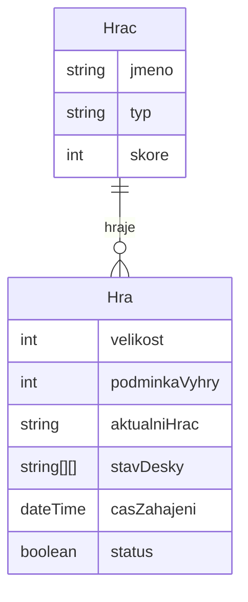
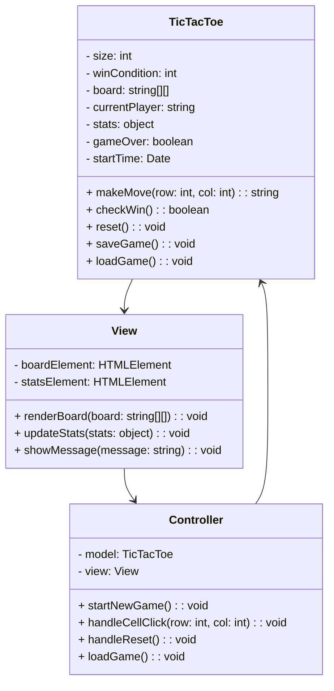

# Funkční a technická specifikace

## Funkční specifikace

### Popis aplikace

Webová aplikace Tic Tac Toe umožňuje uživatelům hrát klasickou hru piškvorky na libovolně velkém hracím poli s možností zvolit si podmínku výhry, hrát proti jinému hráči nebo umělé inteligenci (AI) a ukládat skóre jednotlivých her.

### UseCase diagram

**Hlavní funkce aplikace:**

- Volba velikosti hracího pole a podmínky výhry.
- Možnost hrát proti jinému hráči nebo AI.
- Ukládání stavu hry a skóre.
- Obnova rozehrané hry.

```mermaid
usecaseDiagram
  actor Hráč
  Hráč --> (Volba nastavení hry)
  Hráč --> (Hraní hry)
  Hráč --> (Ukládání skóre)
  Hráč --> (Obnova rozehrané hry)
```

### Uživatelské role a oprávnění

1. **Hráč:**
   - Přístup ke všem funkcím aplikace.
   - Možnost hrát proti jinému hráči nebo AI.
   - Možnost uložit skóre.
   - Možnost resetovat hru nebo obnovit uloženou hru.

### Uživatelské rozhraní (UI)

**Hlavní obrazovka obsahuje:**

- Pole pro zadání velikosti hracího pole.
- Pole pro zadání podmínky výhry.
- Dropdown pro volbu režimu hry (Hráč vs. Hráč, Hráč vs. AI).
- Hrací desku.
- Tlačítko pro spuštění hry.
- Tlačítko pro resetování hry.
- Panel pro zobrazení skóre.

**Grafické prvky:**

- Moderní minimalistický design s dominantní zelenou barvou.
- Responsivní rozvržení pro různá zařízení.
- Přehledná mřížka pro hrací desku s animacemi pro interakce.

---

## Technická specifikace

### Datový logický model

- **Hráč:** Jméno, typ (lidský/AI), skóre.
- **Hra:** Velikost pole, podmínka výhry, aktuální hráč, stav hrací desky, čas zahájení, status (rozehraná/ukončená).



### Popis architektury

Aplikace je strukturována podle modelu MVC (Model-View-Controller):

1. **Model (model.js):**

   - Obsahuje logiku hry (např. kontrola výhry, resetování hry, ukládání stavu hry).
   - Třída `TicTacToe` spravuje stav hry, kontroluje výherní podmínky a zajišťuje ukládání/načítání dat.

2. **View (view\.js):**

   - Zodpovídá za vykreslování uživatelského rozhraní a interakce s uživatelem.
   - Obsahuje metody pro zobrazení hrací desky, aktualizaci skóre a zobrazování zpráv.

3. **Controller (controller.js):**

   - Zajišťuje komunikaci mezi modelem a view.
   - Obsahuje logiku pro zpracování vstupů od uživatele a řízení hry.

### Diagram tříd



### Použité technologie

1. **HTML, CSS, JavaScript:** Struktura, stylování a logika aplikace.
2. **LocalStorage:** Ukládání stavu hry a skóre.
3. **Git:** Dokumentace vývoje aplikace.
4. **Framework:** Aplikace nepoužívá externí framework, vše je implementováno nativně pro přehlednost.

---

Tímto dokumentem je připravena kompletní specifikace aplikace Tic Tac Toe pro zápočtovou práci.

